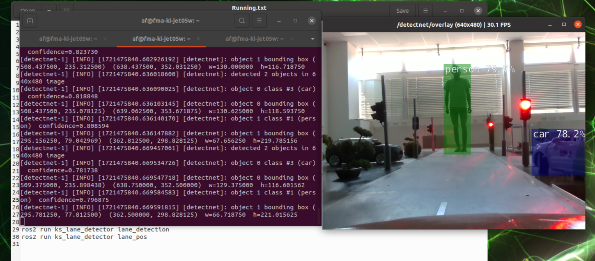
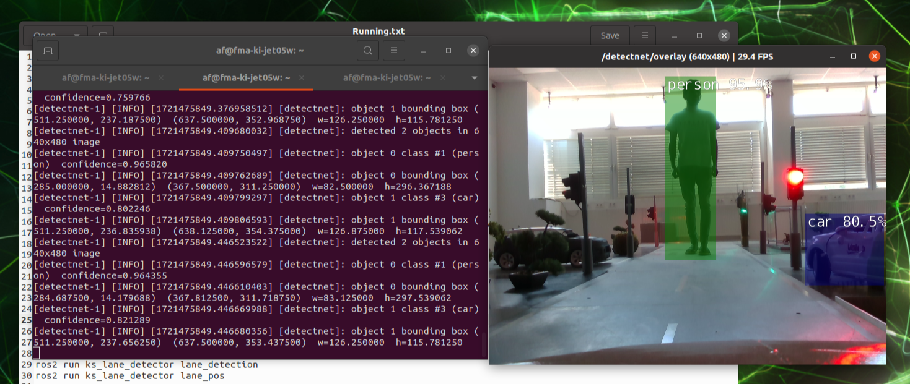
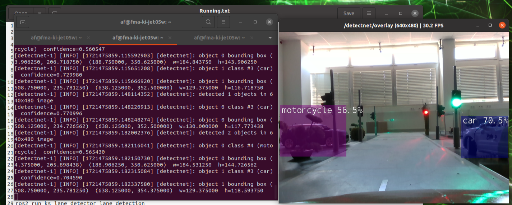
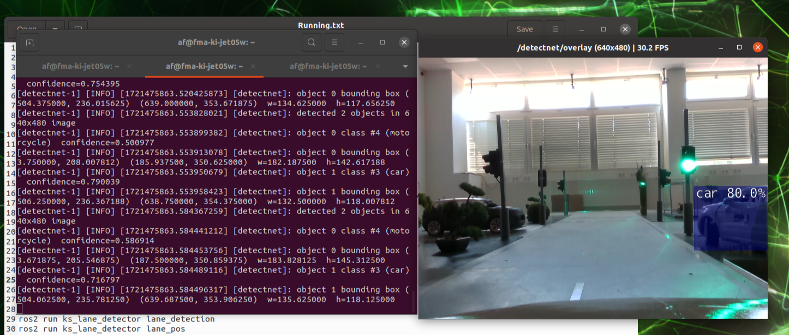
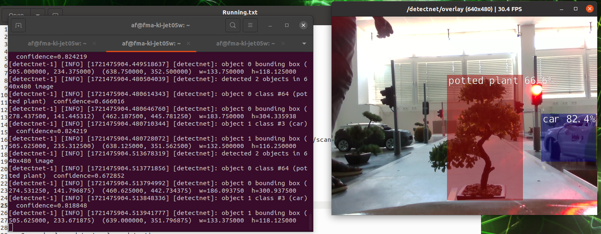
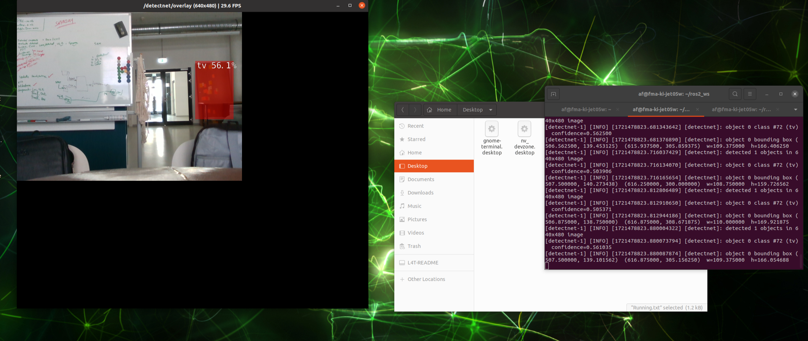

# Object Detection using Detectnet

Detectnet is a neural network designed for object detection tasks. 
We will be evaluating the detectnet for this module and make changes to optimize it to the model city over the next modules. 

## Installation

Firstly for setting up the environment, Clone the detectnet for ros2

```
    git clone https://github.com/dusty-nv/ros_deep_learning.git
```

Next, build and source the files

```
    colcon build
    source install/setup.bash
```

Note that the realsense camera must be running for using the detectnet. 
For launching the IntelRealSense Camera

```
    ros2 launch realsense2_camera rs_launch.py
```

Configure the launch files for the output of the camera '/camera/color/image_raw'
For launching detectnet

```
    ros2 launch ros_deep_learning detectnet.ros2.launch
```

## Evaluation 

Evaluation of the detectnet model is required to see how effective it is at distinguising the different objects. We need to know the accuracy of the model to know how much we can depend on the system.


<div align="center">
    
</div>


<div align="center">
    
</div>


<div align="center">
    
</div>


<div align="center">
    
</div>


<div align="center">
    
</div>


<div align="center">
    
</div>
