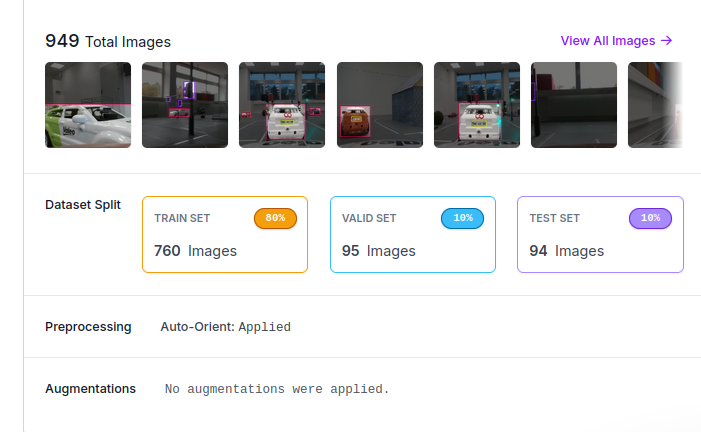
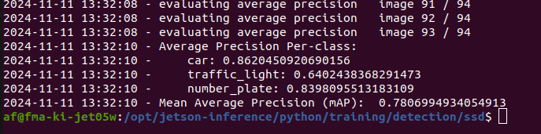
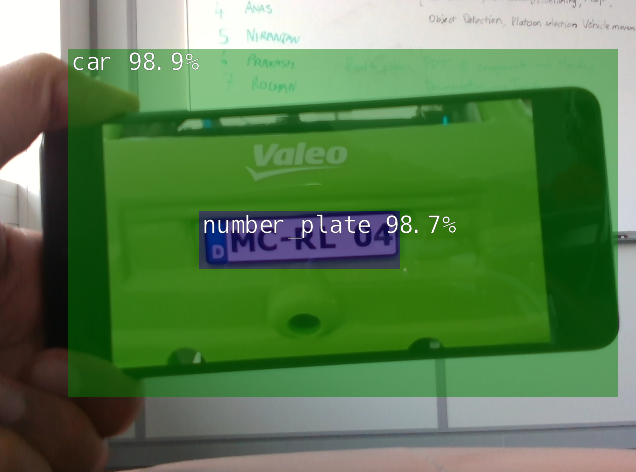

# Object Detection using Detectnet

Detectnet is a neural network designed for object detection tasks. 
We will be evaluating the detectnet for this module and make changes to optimize it to the model city over the next modules. 

## Installation

Firstly for setting up the environment, Clone the detectnet for ros2

```
    git clone https://github.com/dusty-nv/ros_deep_learning.git
```

Next, build and source the files

```
    colcon build
    source install/setup.bash
```

Note that the realsense camera must be running for using the detectnet. 
For launching the IntelRealSense Camera

```
    ros2 launch realsense2_camera rs_launch.py
```

Configure the launch files for the output of the camera '/camera/color/image_raw'
For launching detectnet

```
    ros2 launch ros_deep_learning detectnet.ros2.launch
```

## Evaluation 

Evaluation of the detectnet model is required to see how effective it is at distinguising the different objects. We need to know the accuracy of the model to know how much we can depend on the system. The evaluation was done in the module 3 and the [results can be found here.](https://git.hs-coburg.de/KickStart/ks_object_detection/src/branch/main/OldReadme.md)

## Transfer Learning

The learnings from the transfer learning was used with the project work to make the detectnet better and work well with respect to what is needed in the project. For the transfer learning exercise, we made use of three classes - car, number_plate and traffic_light.

949 images were used as the dataset for transfer learning. The dataset was split as 80% training data, 10% validation data and 10% test data as seen in the image below. 

<div align="center">
    
</div>

The training was done on the dataset after which the team evaluated the model. The image below shows the Mean Average Precision for the three classes to be 78%.

<div align="center">
    
</div>

The detectnet module works well with the trained classes and the performance has been observed to be better. It can be further evaluated over the next module. The imaage of the car and number plate recognition is shown below. 

<div align="center">
    
</div>
